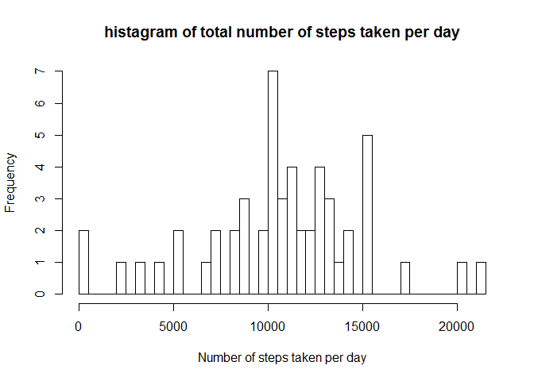
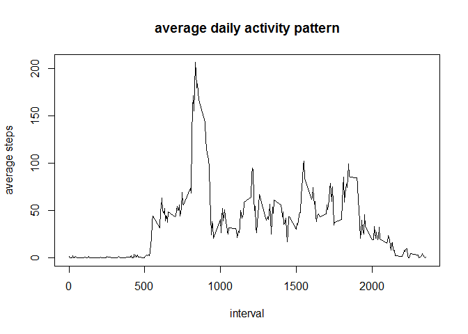
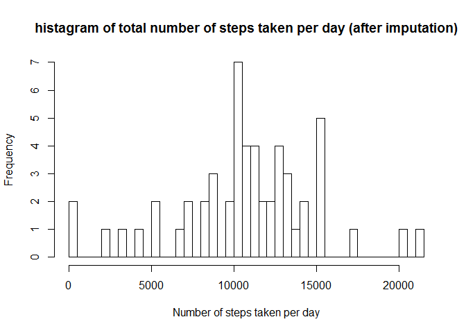
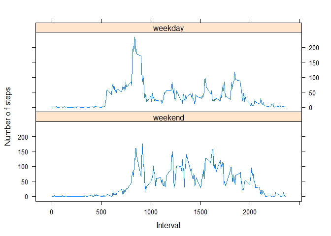

# Reproducible Research: Peer Assessment 1


## Loading and preprocessing the data

```r
a_t <- read.csv(unz("activity.zip", "activity.csv"))
a_t$date <- as.Date(a_t$date)
daily_steps <- aggregate(steps~date, a_t, sum)
interval_steps <- aggregate(steps~interval, a_t, mean)
```

## What is mean total number of steps taken per day?
Here is a histagram of the total number of steps taken each day:

```r
hist(daily_steps$steps, breaks=40, main="histagram of total number of steps taken per day", xlab="Number of steps taken per day")
```

 


```r
mean_s <- mean(daily_steps$steps, na.rm=TRUE)
median_s <- median(daily_steps$steps, na.rm=TRUE)
```
The mean of total number of steps taken per day is 1.0766 &times; 10<sup>4</sup> and the median is 10765.


## What is the average daily activity pattern?

```r
plot(interval_steps$interval, interval_steps$steps, type='l', main="average daily activity pattern", xlab="interval", ylab="average steps")
```

 

```r
mostactive_interval <- interval_steps[interval_steps$steps==max(interval_steps$steps), "interval"]
```


The daily activity pattern is shown as above and the interval that, on average, contains the maximum number of steps is 835.

## Imputing missing values

```r
num_na <- sum(is.na(a_t))
```
There are in total 2304 missing values in the dataset. 


```r
sim_t <- a_t
sim_t$steps[is.na(a_t$steps)] <- round(interval_steps$steps[interval_steps$interval == a_t$interval[is.na(a_t$steps)]])
sim_daily_steps <- aggregate(steps~date, sim_t, sum)
mean_sim <- mean(sim_daily_steps$steps, na.rm=TRUE)
median_sim <- median(sim_daily_steps$steps, na.rm=TRUE)
```
To impute the missing data in steps, mean of steps in the 5-minute interval are rounded and used. 


```r
hist(sim_daily_steps$steps, breaks=40, main="histagram of total number of steps taken per day (after imputation)", xlab="Number of steps taken per day")
```

 


In the new dataset, the mean of total steps per day is 1.0766 &times; 10<sup>4</sup> and the median is 1.0763 &times; 10<sup>4</sup>. 

## Are there differences in activity patterns between weekdays and weekends?

```r
library(timeDate)
sim_t$weekday <- factor(isWeekday(sim_t$date), labels=c("weekend", "weekday"))
bydaytype_steps_interval <- aggregate(steps~weekday+interval, sim_t, mean)
library(lattice)
xyplot(bydaytype_steps_interval$steps~bydaytype_steps_interval$interval|bydaytype_steps_interval$weekday, type="l", layout=c(1,2), xlab="Interval", ylab="Number o f steps")
```

 


The panel plot shows that the activity patterns of weekdays and weekends are different.

